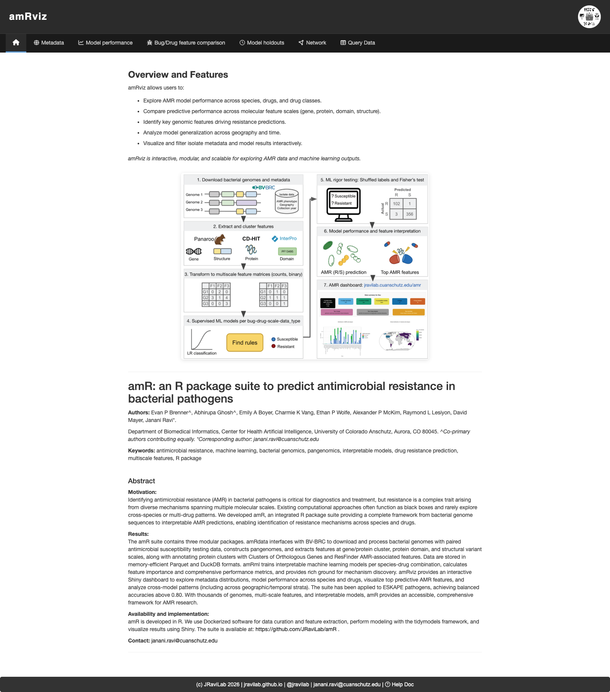
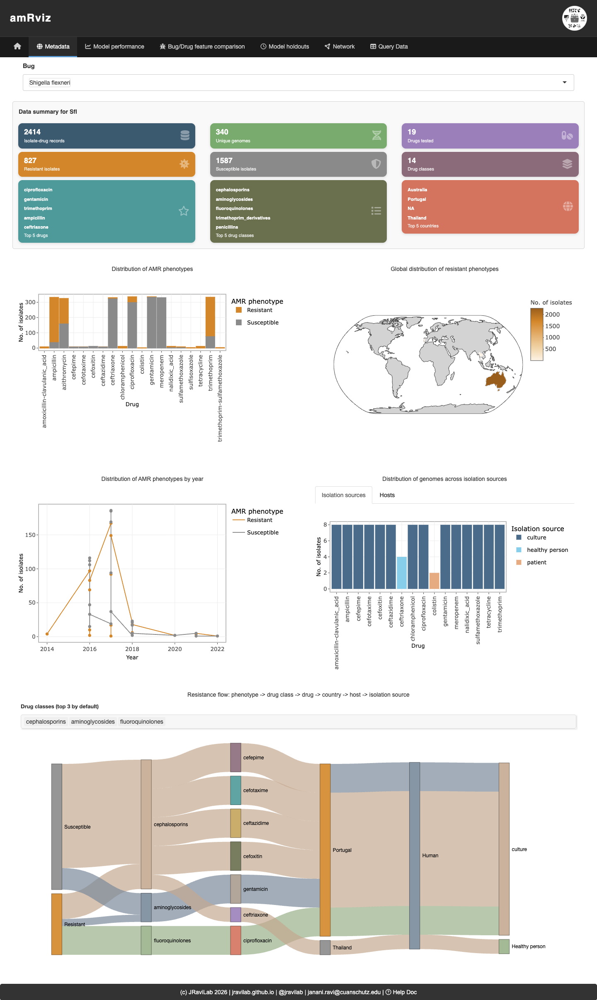
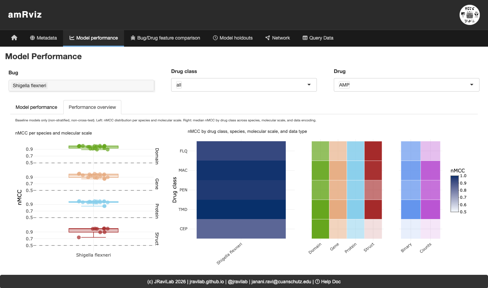
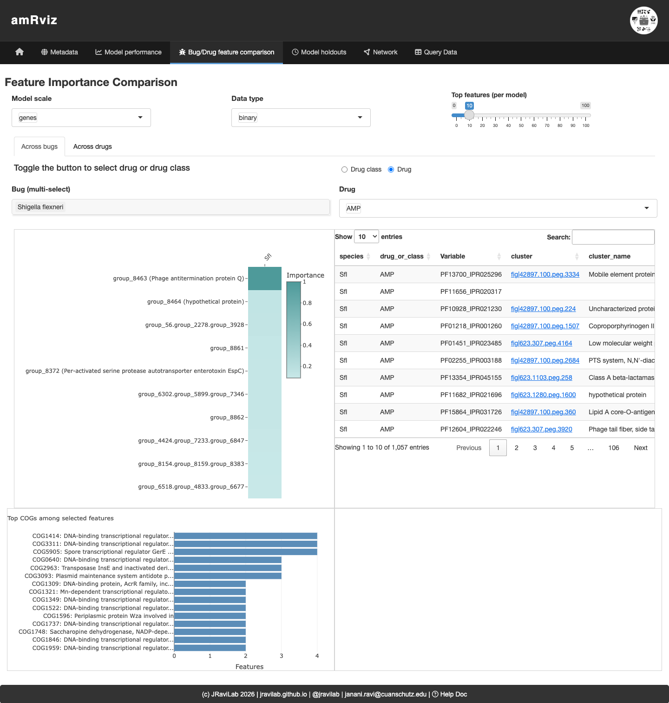
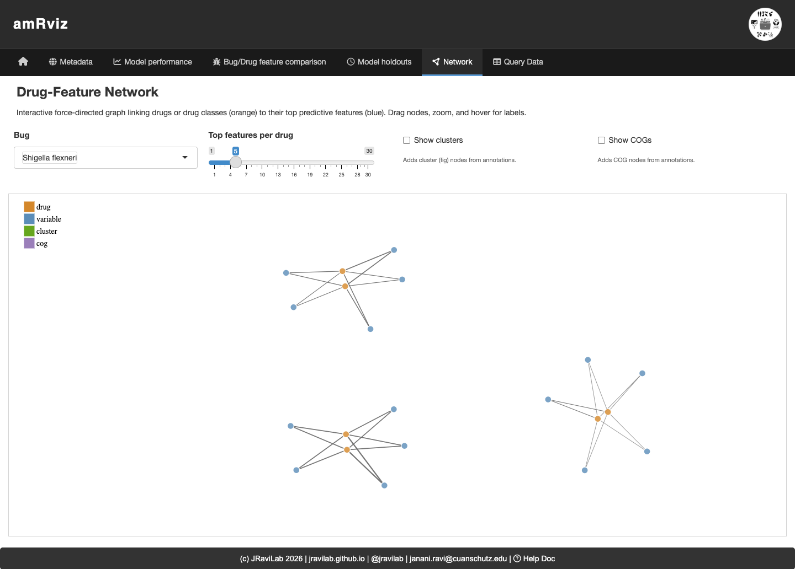

```{r setup, include = FALSE}
knitr::opts_chunk$set(
  collapse = TRUE,
  comment = "#>"
)
```

## Overview

**amRviz** is an interactive Shiny dashboard for exploring antimicrobial
resistance (AMR) data and machine-learning model results. It is the
visualization layer of the [amR suite](https://github.com/JRaviLab/amR):

| Package | Role |
|---|---|
| [amRdata](https://github.com/JRaviLab/amRdata) | Downloads bacterial genomes and antimicrobial susceptibility data from BV-BRC, builds pangenomes, and extracts multi-scale features (genes, proteins, domains, structures). |
| [amRml](https://github.com/JRaviLab/amRml) | Trains interpretable ML models per species–drug combination and computes feature importance and performance metrics. |
| **amRviz** | Provides the interactive dashboard that visualizes the metadata and model outputs produced by the first two packages. |

amRviz lets researchers compare results across species, drugs and drug classes,
molecular feature scales, and biologically relevant strata (e.g. country, year),
all without writing code. This vignette walks through the data it consumes, how
to launch it, and a guided tour of the dashboard's tabs.

## Questions amRviz helps you answer

- Which molecular scale (gene, protein, domain, structure) predicts resistance
  best for a given bug–drug combination?
- Which genomic features drive resistance predictions, and are they conserved
  across drugs or species?
- Do model features and performance shift across geography or time?
- How is AMR surveillance metadata distributed across phenotypes, countries,
  hosts, and sources?

## Installing and launching

Install the package and launch the app with a single call:

```{r, eval = FALSE}
if (!requireNamespace("BiocManager", quietly = TRUE)) {
  install.packages("BiocManager")
}

BiocManager::install("amRviz")

library(amRviz)
launchAMRDashboard()
```

`launchAMRDashboard()` returns a Shiny application object and opens the
dashboard in your default browser. With no arguments it loads the bundled demo
data for *Shigella flexneri*, so you can explore every tab immediately.

To explore your own results, point the app at an amRml output directory:

```{r, eval = FALSE}
launchAMRDashboard(results_root = "/path/to/your/amRml/results")
```

The species dropdowns populate automatically from whichever data is loaded.
There are no hardcoded species lists.

## The data amRviz reads

amRviz reads the Parquet files written by **amRml**, organized into one
subdirectory per species. The subdirectory name (e.g. `Shigella_flexneri`)
becomes the display label throughout the dashboard, while a short species code
(e.g. `Sfl`) inside each file is used for internal filtering.

```
results/
└── Shigella_flexneri/
    ├── Sfl_ML_perf.parquet              # baseline model performance
    ├── Sfl_country_ML_perf.parquet      # country-stratified models
    ├── Sfl_year_ML_perf.parquet         # year-stratified models
    ├── Sfl_cross_ML_perf.parquet        # cross-tested models
    ├── Sfl_ML_top_features.parquet      # top predictive features
    ├── Sfl_country_ML_top_features.parquet
    ├── Sfl_year_ML_top_features.parquet
    ├── Sfl_metadata.parquet             # isolate surveillance metadata
    └── cluster_feature_COG.parquet      # optional COG/annotation lookup
```

Three file types drive the dashboard:

**Performance metrics** (`*_ML_perf.parquet`) has one row per model. Key columns:

| Column | Description |
|---|---|
| `species` | Species code (e.g. `Sfl`) |
| `drug_or_class` | Drug or drug-class abbreviation |
| `drug_label` | `drug` or `drug_class` |
| `feature_type` | Molecular scale: `genes`, `proteins`, `domains`, `struct` |
| `feature_subtype` | Data encoding: `binary` or `counts` |
| `strat_label` | Stratification: blank (baseline), `country`, or `year` |
| `strat_value` / `strat_value_test` | Trained-on / tested-on stratum |
| `mcc`, `bal_acc`, `f1`, `sens`, `spec` | Performance metrics |

**Top features** (`*_ML_top_features.parquet`), ranked predictive features per
model, with `Variable` (feature ID), `Importance` (score), and `Sign`
(direction of effect).

**Metadata** (`*_metadata.parquet`) contains one row per genome–drug test, with
`genome_drug.resistant_phenotype` (Resistant/Susceptible),
`genome.isolation_country`, `genome.collection_year`,
`genome.host_common_name`, `genome.isolation_source`, and `drug_class`.

> If an annotation root (`amRdata`) is available, amRviz also links features to
> Clusters of Orthologous Genes (COGs) and ResFinder AMR genes. Pass it via
> `launchAMRDashboard(amrdata_root = "~/amRdata/data")`; otherwise
> annotation-based columns and network nodes are simply omitted.

## A tour of the dashboard

The dashboard is organized into a top navigation bar. Each tab is a different
view of the same loaded data; filters at the top of each tab update its plots
in place. Common filters include **Bug/Species**, **Drug** or **Drug class**,
**Model scale** (genes / proteins / domains / structures), and **Data type**
(binary / counts).

### Home

The landing page summarizes what amRviz does, shows the amR suite workflow, and
includes the project abstract and citation.

```{r, echo = FALSE, out.width = "100%"}

```

### Metadata

Explore AMR surveillance metadata for a selected species. Summary cards give
quick counts (genomes, drugs, drug classes, resistant vs. susceptible tests),
and the plots below break resistance down by drug, geography, year, host, and
isolation source. The Sankey diagram at the bottom traces the flow from
phenotype → drug class → drug → country → host → isolation source, making it
easy to see where resistant isolates concentrate.

```{r, echo = FALSE, out.width = "100%"}

```

### Model performance

Compare model performance across drugs and molecular scales. Pick a bug, drug
class, and drug; the **Model performance** sub-tab shows per-model metric
distributions, while the **Performance overview** sub-tab (below) gives a
bird's-eye summary of baseline models: a strip plot of nMCC by molecular scale
(left) and heatmaps of median nMCC by drug class across scale and data encoding
(right). Here, domain- and gene-scale models reach the highest nMCC for most
drug classes.

```{r, echo = FALSE, out.width = "100%"}

```

### Bug/Drug feature comparison

Investigate the genomic features driving predictions. The **Across bugs**
sub-tab compares ranked features for a given drug or class across selected
species; the **Across drugs** sub-tab compares top features across drugs within
one species. The importance plot, annotated feature table (with COG and NCBI
HMM links), COG-category barplot, and ego network let you see which features are
shared and what they encode.

```{r, echo = FALSE, out.width = "100%"}

```

### Model holdouts

Assess how models generalize across geography and time. For a chosen bug and
drug, the **Accuracy distributions** and **Model performance** sub-tabs compare
country-holdout vs. year-interval models side by side, and **Top features**
reveals which predictors are shared or exclusive across strata.

### Network

An interactive force-directed graph links drugs or drug classes (orange) to
their top predictive features (blue), with optional cluster and COG nodes. Drag
nodes, zoom, and hover for labels to explore how features are shared across
drugs. Features that connect to multiple drugs are candidate broad-spectrum
resistance determinants.

```{r, echo = FALSE, out.width = "100%"}

```

### Query data

Browse and export the underlying tables. The **Performance Metrics** and **Top
Features** tabs render the raw amRml output as searchable tables; add or remove
columns and download the customized view as CSV for downstream analysis.

## Exporting figures without the dashboard

Sometimes you want the figures, not the interactive app — for a report, a
manuscript, or an automated pipeline. `exportAMRVisualizations()` renders every
visualization the dashboard produces to static image files, without launching
Shiny:

```{r, eval = FALSE}
# Bundled demo data -> ./amRviz_exports/ as PNG + PDF
exportAMRVisualizations()

# Your own results, choosing formats, output location, and species
exportAMRVisualizations(
  output_dir   = "figures",
  formats      = c("png", "pdf", "jpg"),
  results_root = "/path/to/your/amRml/results",
  species      = c("Shigella_flexneri", "Shigella_sonnei")
)
```

The exporter produces one figure set per species, using the same default
selections each tab opens with (all molecular scales, binary encoding,
gentamicin where present, the top drug classes for the metadata Sankey, and so
on). Two of those defaults are adjustable from the call: `top_n_features` sets
how many features each feature-importance panel shows, and `network_top_n` sets
how many top features per drug go into the drug-feature network. Files are laid
out by species:

```
figures/
├── _overview/                        # performance heatmaps (all species)
│   ├── mcc_strip_by_species_scale.png
│   └── mcc_heatmap_overview.png
├── _across_species/                  # cross-species feature importance
│   └── feature_importance_GEN.png
└── Shigella_flexneri/
    ├── model_performance.png
    ├── feature_importance_across_drugs.png
    ├── cog_categories.png
    ├── holdout_ridge_country.png
    ├── drug_feature_network.png
    ├── metadata_geographic.png
    └── ...
```

A few practical notes:

- **Formats.** All four (`png`, `jpg`, `pdf`, `svg`) are supported. `png` is a
  headless-Chrome screenshot; `jpg` and `pdf` are re-encodes of that PNG (so
  every raster format has the same crop and dimensions). `svg` is extracted
  from the rendered DOM and inlines every text element so nothing is lost.
- **How it works.** Every amRviz plot is an interactive `plotly` or `networkD3`
  htmlwidget, so there is no server-side raster renderer. Export instead
  drives each widget with a headless Chrome through the `webshot2` and
  `chromote` packages, then reformats via `magick`. Install Google Chrome or
  Chromium if you do not already have one; `exportAMRVisualizations()` stops
  early with an informative message if no browser is found.
- **Return value.** The function invisibly returns a data frame summarizing each
  attempted figure (its group, name, number of files written, and whether it
  succeeded), which is useful for logging in batch runs.

## Session information

```{r}
sessionInfo()
```
